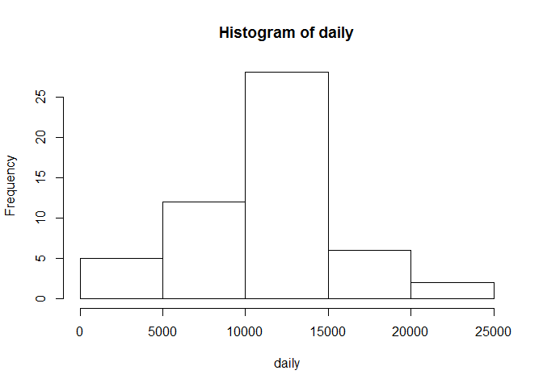
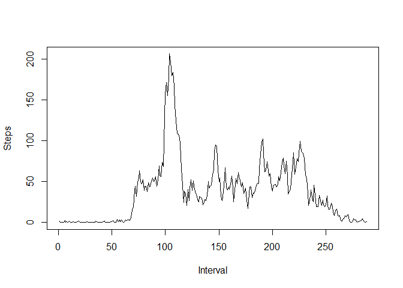
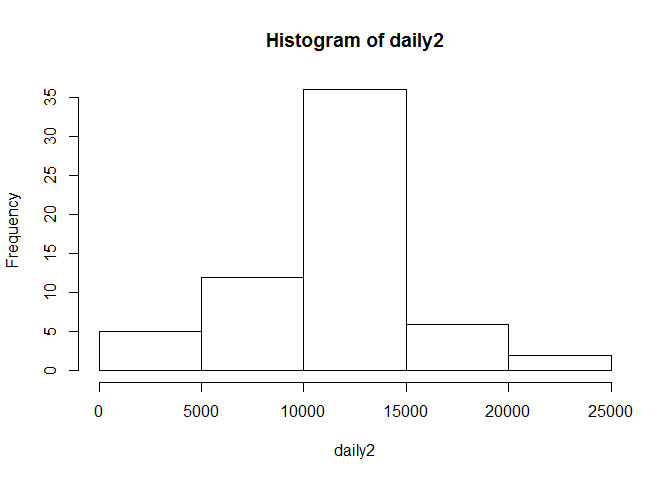
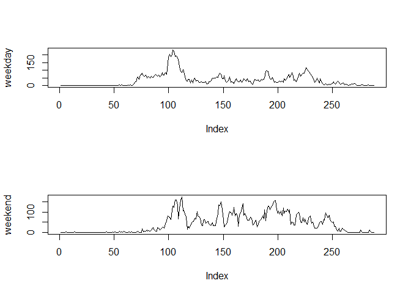

# Reproducible Research: Peer Assessment 1


## Loading and preprocessing the data
First we load the data and convert the dates appropriately:


```r
data<-read.csv("../activity.csv")
data$date<-as.Date(data$date)
library(lattice)
```

## What is mean total number of steps taken per day?
Group data by day and sum, then output a histogram:


```r
daily<-tapply(data$steps, data$date, sum)
hist(daily)
```

\

Calculate the mean and median steps per day:

```r
mean(daily, na.rm=T)
```

```
## [1] 10766.19
```

```r
median(daily, na.rm=T)
```

```
## [1] 10765
```

## What is the average daily activity pattern?
Calculate and plot average daily activity:

```r
averageintervals<-tapply(data$steps, data$interval, mean, na.rm=T)
plot(averageintervals, type="l", xlab="Interval", ylab="Steps")
```

\

Find the interval with max average steps:


```r
which.max(averageintervals)
```

```
## 835 
## 104
```

```r
max(averageintervals)
```

```
## [1] 206.1698
```

(Interpret that as minute 835 during the day, 104th element in the array I think)

## Imputing missing values

Calculate number of missing values:

```r
sum(is.na(data$steps))
```

```
## [1] 2304
```

Let's fill the missing rows with the average number of steps from the dataset as a whole, and then repeat the steps from above.


```r
mean(data$steps, na.rm=T)
```

```
## [1] 37.3826
```

```r
data2<-data
data2$steps[is.na(data$steps)]<-37.3
daily2<-tapply(data2$steps, data2$date, sum)
hist(daily2)
```

\

```r
mean(daily2, na.rm=T)
```

```
## [1] 10763.07
```

```r
median(daily2, na.rm=T)
```

```
## [1] 10742.4
```

## Are there differences in activity patterns between weekdays and weekends?

Making two plots to compare weekday and weekend activity:


```r
weekdays<-weekdays(data$date)
DOW<-function(x){if(x=="Saturday"|x=="Sunday") "weekend" else "weekday"}
weekendfactor<-sapply(weekdays, DOW)
data<-cbind(data, weekendfactor)
averageintervals<-tapply(data$steps, list(data$interval, data$weekendfactor), mean, na.rm=T)
par(mfrow=c(2,1))
plot(averageintervals[,1],type="l", ylab="weekday")
plot(averageintervals[,2],type="l", ylab="weekend")
```

\
